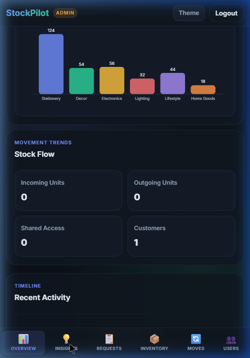
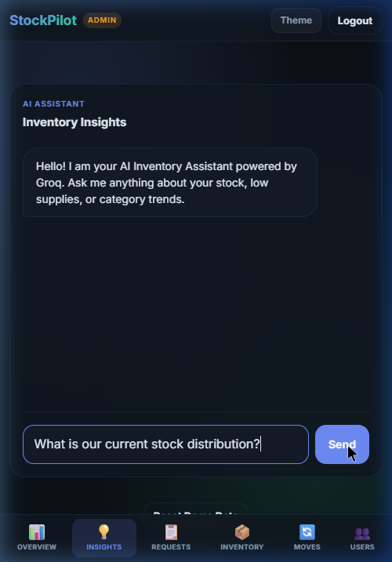

# 🚀 StockPilot

<div align="center">
  <h1>StockPilot</h1>
  <p><strong>A Next-Generation Intelligent Inventory Management System</strong></p>
  <br />
  
  <br /><br />
  <a href="#live-website-link">🌐 <strong>Live Website</strong></a> &nbsp; | &nbsp; 
  <a href="#apk-download-link">📱 <strong>Download Android APK</strong></a>
</div>

---

## 📖 Table of Contents
- [Project Overview](#-project-overview)
- [System Architecture](#-system-architecture)
- [Core Features](#-core-features)
  - [Admin Panel](#-admin-panel)
  - [Customer Panel](#-customer-panel)
  - [AI Inventory Assistant](#-ai-inventory-assistant)
- [Tech Stack](#-tech-stack)
- [Security & Performance](#-security--performance)
- [Screenshots](#-screenshots)
- [Installation & Setup](#-installation--setup)

---

## 🌟 Project Overview
**StockPilot** goes beyond traditional inventory tracking by introducing an advanced **Role-Based Access Control (RBAC)** architecture, an integrated **Approval Workflow System**, and a state-of-the-art **AI-Powered Inventory Assistant**. 

Designed with a premium, responsive dark/light mode interface, StockPilot is built to help administrators and customers seamlessly manage products, record stock movements, track dynamic analytics, and automate tasks through natural language queries.

---

## 🏗️ System Architecture

StockPilot is structured as a highly scalable full-stack application.

1. **Client Layer (Web & Mobile)**: 
   - A lightning-fast Vanilla HTML/CSS/JS frontend ensures zero framework overhead. 
   - Cross-platform ready: Deployed as a web application and packaged natively as an **Android APK** using Capacitor/Cordova.
2. **Application Layer (Node.js & Express.js)**: 
   - A RESTful API backend handling business logic, JWT authentication, request validation, and AI prompt orchestration.
3. **Data Layer (MongoDB Atlas)**: 
   - A NoSQL cloud database utilizing Mongoose schemas for `Users`, `Products`, `Movements`, `Requests`, and `Shares`.
4. **AI Processing Layer (Groq API)**: 
   - Integrates the blazing-fast `Llama-3.1-8b-instant` LLM to provide contextual, data-aware inventory insights to the user.

---

## ✨ Core Features

### 👨‍💼 Admin Panel
- **Complete Inventory Control**: Easily add, update, and delete products. Track essential metadata including SKU, Supplier, Category, Price, Quantity, Storage Location, and Barcode.
- **Stock Movement Tracking**: Seamlessly record stock-in and stock-out operations. The system calculates amount totals automatically and maintains a full audit log.
- **Request Approval Workflow**: Customers can submit inventory change requests. Admins can review, approve, and execute them with a single click, or reject them with feedback notes.
- **User Management**: Suspend or activate customer accounts to maintain platform security. Generate secure, one-time `Share Tokens` to grant external viewers access to inventory data.
- **Analytics Dashboard**: Real-time summary cards, latest movement feeds, and low-stock indicators.

### 👥 Customer Panel
- **Secure Browsing**: Customers can view available stock levels and categories but are restricted from viewing sensitive business data (like supplier details or exact warehouse locations).
- **Interactive Requests**: Customers can actively participate in inventory management by submitting requests to add new products or record movements.
- **Request Tracking**: Monitor the lifecycle of submitted requests (Pending, Approved, Rejected) directly from the customer dashboard.

### 🤖 AI Inventory Assistant
- **Context-Aware Insights**: Powered by the **Groq API**, users can ask natural language questions about their inventory (e.g., *"Which electronics are low on stock?"*).
- **Role-Based AI Logic**: The AI intelligently adapts its responses based on the user's role. It will hide SKUs and sensitive data from customers, while giving full administrative data to admins.
- **Dynamic Mermaid Charts**: The AI is programmed to generate visual `pie` charts and `xychart-beta` bar graphs inside the chat interface to visualize stock distributions dynamically!

---

## 🛠️ Tech Stack

- **Frontend**: HTML5, CSS3 (Modern Variables & Responsive Design), Vanilla JavaScript (ES6+).
- **Backend Runtime**: Node.js.
- **Web Framework**: Express.js.
- **Database**: MongoDB Atlas (NoSQL) with Mongoose ORM.
- **Authentication**: JWT (JSON Web Tokens), `bcryptjs` for secure password hashing, `cookie-parser` for XSS-proof HTTP-only cookies.
- **AI Integration**: Groq Cloud API (`Llama-3.1-8b-instant`).
- **Mobile Environment**: Capacitor/Cordova wrapper for Android deployment.

---

## 🔒 Security & Performance

- **Hardened Authentication**: User sessions are securely managed via `HttpOnly` cookies, completely mitigating Cross-Site Scripting (XSS) token theft.
- **Role-Based Middlewares**: Strict backend routing protections (`adminOnly`, `customerOnly`) ensure authorization at the server level.
- **AI Rate Limiting**: The Groq AI insights route utilizes an in-memory rate limiter (max 5 requests per minute per user) to prevent API abuse and control cloud costs.
- **Robust Validation**: Server-side validation safeguards database integrity when adding products, logging movements, and processing user inputs.

---

## 📸 Screenshots

<div align="center">
  
  
</div>

---

## 🚀 Installation & Setup

### Prerequisites
- [Node.js](https://nodejs.org/) (v16 or higher)
- [MongoDB Atlas](https://www.mongodb.com/cloud/atlas) Connection URI
- [Groq](https://groq.com/) API Key

### Local Development

1. **Clone the repository:**
   ```bash
   git clone https://github.com/vedant27-lab/stockpilot.git
   cd stockpilot
   ```

2. **Install dependencies:**
   ```bash
   npm install
   ```

3. **Environment Setup:**
   Create a `.env` file in the root directory and add your credentials:
   ```env
   PORT=3000
   MONGO_URI=your_mongodb_connection_string
   JWT_SECRET=your_super_secret_jwt_key
   GROQ_API_KEY=your_groq_cloud_api_key
   ```

4. **Start the application:**
   ```bash
   npm run dev
   ```
   Navigate to `http://localhost:3000` in your web browser.

---

## 📦 Deployment Links

### 🌐 [Live Website Application](https://stockpilot-mpne.onrender.com/) 

### 📱 [Download Android APK](https://drive.google.com/file/d/16imkT3gR3rYfuBK_M48GwIiio4IM2FTr/view?usp=sharing) 

---
<div align="center">
  <i>Developed with ❤️ by Vedant</i>
</div>
